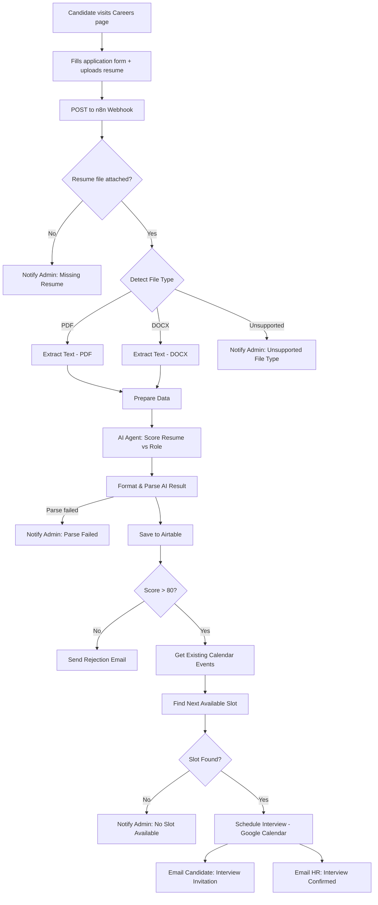

# NovaTech AI Hiring Platform

An end-to-end automated hiring pipeline: candidates apply through a careers website, and an AI agent screens their resume, scores them against the role, saves the result, and either schedules an interview or sends a rejection — all without manual intervention.

## Overview

This project has two parts that work together:

1. **Careers Website** (`website/`) — A responsive, static site (HTML/CSS/JS) where candidates browse open positions and submit an application form (name, email, position, experience, cover letter, resume file).
2. **AI Screening & Scheduling Workflow** (`workflow/`) — An [n8n](https://n8n.io) automation that receives the submission, extracts and evaluates the resume with an AI agent, records the result, and either books an interview slot on Google Calendar or sends an automated rejection email.

No manual resume review is required for the first-pass filter — the workflow handles intake, evaluation, record-keeping, and candidate/HR communication end to end.

## Architecture



This diagram renders automatically on GitHub. If you'd rather keep a static image version too (e.g. exported straight from the n8n canvas), drop it in `docs/images/architecture-diagram.png` and reference it below:

```md

```

### Flow in plain terms

1. Candidate submits the form on the website → resume file + application details are POSTed to an n8n webhook.
2. The workflow validates the upload, detects whether it's a PDF or DOCX, and extracts the raw text.
3. An AI agent (Gemini) evaluates the resume against typical requirements for the applied-to role and returns a structured score, strengths, weaknesses, and missing skills.
4. The result is saved to Airtable (upserted by email, so re-applications don't create duplicates).
5. If the score is above 80, the workflow finds the next open interview slot (10 AM–7 PM, weekdays, 30-min slots) on Google Calendar, books it, and emails both the candidate and HR.
6. If the score is 80 or below, the candidate gets an automated, courteous rejection email.
7. Every failure point (missing file, unsupported format, AI parse failure, no calendar slot) notifies an admin by email instead of failing silently.

## Tech Stack

| Layer | Tech |
|---|---|
| Frontend | HTML, CSS, vanilla JavaScript |
| Automation / Backend | [n8n](https://n8n.io) (cloud or self-hosted) |
| AI Scoring | Google Gemini (via n8n LangChain node) |
| Data Store | Airtable |
| Scheduling | Google Calendar API |
| Notifications | Gmail |

## Folder Structure

```
ai-hiring-platform/
├── README.md
├── .gitignore
├── website/
│   ├── index.html          # Careers page: hero, job listings, application form
│   ├── script.js           # Form validation, submission handling, UI interactions
│   └── styles.css          # Styling
├── workflow/
│   └── ai-resume-screening-workflow.json   # Full n8n workflow export
└── docs/
    └── images/
        ├── architecture-diagram.png   # optional static version of the diagram above
        ├── n8n-canvas-overview.png    # screenshot of the workflow canvas
        └── website-preview.png        # screenshot of the live careers page
```

## Setup

### 1. Website

No build step needed — it's a static site.

```bash
cd website
# open index.html directly, or serve it locally, e.g.:
npx serve .
```

In `script.js`, point the form submission at your n8n webhook URL:

```js
const WEBHOOK_URL = "https://<your-instance>.app.n8n.cloud/webhook/resume-upload";
```

### 2. Workflow (n8n)

1. In n8n, go to **Workflows → Import from File** and select `workflow/ai-resume-screening-workflow.json`.
2. Reconnect credentials for each service the workflow uses — the JSON only stores credential *references* (IDs/names), not secrets, so you'll need to re-select or re-create:
   - Gmail (OAuth2)
   - Google Calendar (OAuth2)
   - Airtable (OAuth2)
   - Google Gemini API key
3. Update the Airtable **base** and **table** references if you're using your own base.
4. Activate the workflow and copy the **production webhook URL** into `script.js` (step 1 above).

### 3. Airtable

Create a `Candidates` table with these fields: `Name`, `Email`, `Position`, `Score`, `Skills`, `Missing Skills`, `Strengths`, `Weaknesses`, `Total Years Experience`, `Evaluated At`.

## Adding Screenshots / Diagram Images

1. Export a screenshot of your n8n canvas (or take one like the code screenshot you shared) and save it as `docs/images/n8n-canvas-overview.png`.
2. Save a careers-page screenshot as `docs/images/website-preview.png`.
3. Reference them anywhere in this README with:
   ```md
   
   ```
4. Keep the actual `.json` workflow export in `workflow/` — **do not** put it inside `docs/images/`; images folder is visuals only, the JSON is the real automation source of truth.

## What NOT to Commit (.gitignore)

The included `.gitignore` excludes:
- `.env` / environment files (if you later add any API keys directly instead of using n8n's credential store)
- OS/editor junk (`.DS_Store`, `.vscode/`)
- `node_modules/`, build output, logs

**Before your first push**, open `workflow/ai-resume-screening-workflow.json` and confirm no real API keys, tokens, or personal email addresses you don't want public are hardcoded in it — n8n exports usually only include credential *IDs*, not the secrets themselves, but it's worth a quick check since Gmail addresses used for testing (like `letsautomatewithumer@gmail.com`) are visible in plain text in node parameters.

## Roadmap Ideas

- [ ] Add a `/status` page for candidates to check application status
- [ ] Support multiple interviewers / round-robin scheduling
- [ ] Slack notification option alongside email
- [ ] Configurable score threshold per role